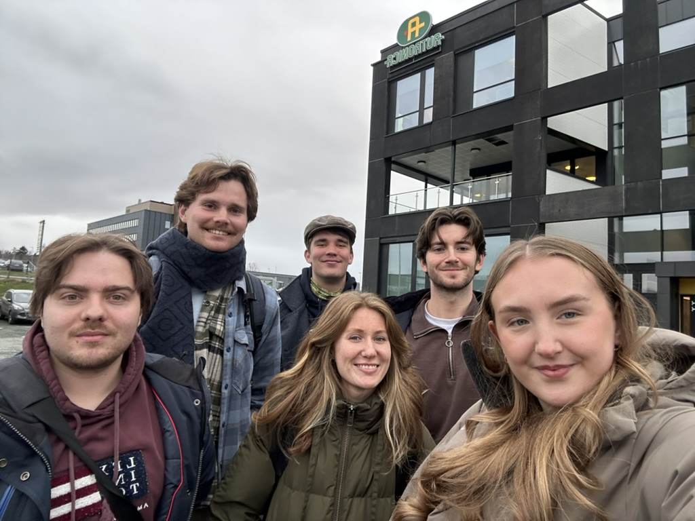

# Autronica-Onboarding

<div align="center">


[](https://img.shields.io/badge/version-1.0.0-blue)

</div>

## Description

This project is part of TDT4290 Customer Driven Project, a course at the Norwegian University of Science and Technology, where we were assigned to develop an onboarding application for Autronica AS. The aim of the course is to give the students practical experience collaborating with external product owners and engaging in real-world development processes.

## How to run and install

If you simply want to try out the application, recommended course of action is to download the latest APK file from the [releases page](TODO)) and install it on your Android device or emulator. To install an APK file on the emulator, simply drag the APK onto the emulator screen. An APK Installer dialog will appear, and once the installation is finished, you'll find the app in your list of installed apps. On a physical Android device, you can open the APK file and it will install the file for you.  

Our backend will be hosted on a server until end of 2024, at which point you will have to recompile application either with reference to you own instance of our service locally or on a cloud provider.

### Development

If you want to make changes or develop the application furter, you can follow the steps below to set up the development environment.

#### Flutter

Follow the installation guide on the [official Flutter website](https://flutter.dev/docs/get-started/install) to install Flutter on your machine for android development. After cloning our repository, navigate to the `autronica_onboarding/frontend/autron` directory and run the following command to install all flutter dependencies:

```bash
flutter pub get
```

To run the application on an emulator (make sure to have it running), run the following command:

```bash
flutter run
```

For use with locally ran backend or different cloud instance, you can change the `baseURL` in the `autronica_onboarding/frontend/autron/lib/globals/urls.dart` file.

Further tips and tricks can be found in our [flutter guide](guide/flutter.md)

#### Django

Our backend is completely dockerized, for local development you need to set a flag in the `docker-compose.yml` to dev, then run the following command in the `autronica_onboarding/backend/autron` directory:

```bash
docker compose up --build -d
```

This will build the docker image and run the container in the background. The backend will be available at `localhost:8000` and the admin panel at `localhost:8000/admin`.

Further api documentation can be found at `localhost:8000/swagger`.

For better integration with IDE, you should settup python 3.11 or higher and install the dependencies in the `requirements.txt` file from the `autronica_onboarding/backend/autron` directory. We recommend using a virtual environment for this:

```bash
python -m venv .venv
source .venv/bin/activate
```

Then install the dependencies:

```bash
pip install -r requirements.txt
```

Now you can run the server without docker with:

```bash
python manage.py runserver --settings=autron.settings_dev
```

Further tips and tricks can be found in our [Django guide](guide/django.md)

## Team

The team behind this project is a group of six master’s students in Computer Science at NTNU, and were developed during the autumn semester of 2024. The team consists of:

<table align="center">
    <tr>
        <td align="center">
                <a href="https://github.com/Eduard-Prokhorikhin">
                        <br />
                        <sub><b>Eduard Prokhorikhin</b></sub>
                </a>
        </td>
        <td align="center">
                <a href="https://github.com/julleeee">
                        <br />
                        <sub><b>Julius Schjetne Stensen</b></sub>
                </a>
        </td>
        <td align="center">
                <a href="https://github.com/annaostm">
                        <br />
                        <sub><b>Anna Østmo</b></sub>
                </a>
        </td>
        <td align="center">
                <a href="https://github.com/julievist">
                        <br />
                        <sub><b>Julie Vist</b></sub>
                </a>
        </td>
        <td align="center">
                <a href="https://github.com/AndKlet">
                        <br />
                        <sub><b>Andreas Kletvang</b></sub>
                </a>
        </td>
        <td align="center">
                <a href="https://github.com/Magnusfv">
                        <br />
                        <sub><b>Magnus Fylling Vik</b></sub>
                </a>
        </td>
    </tr>
</table>


